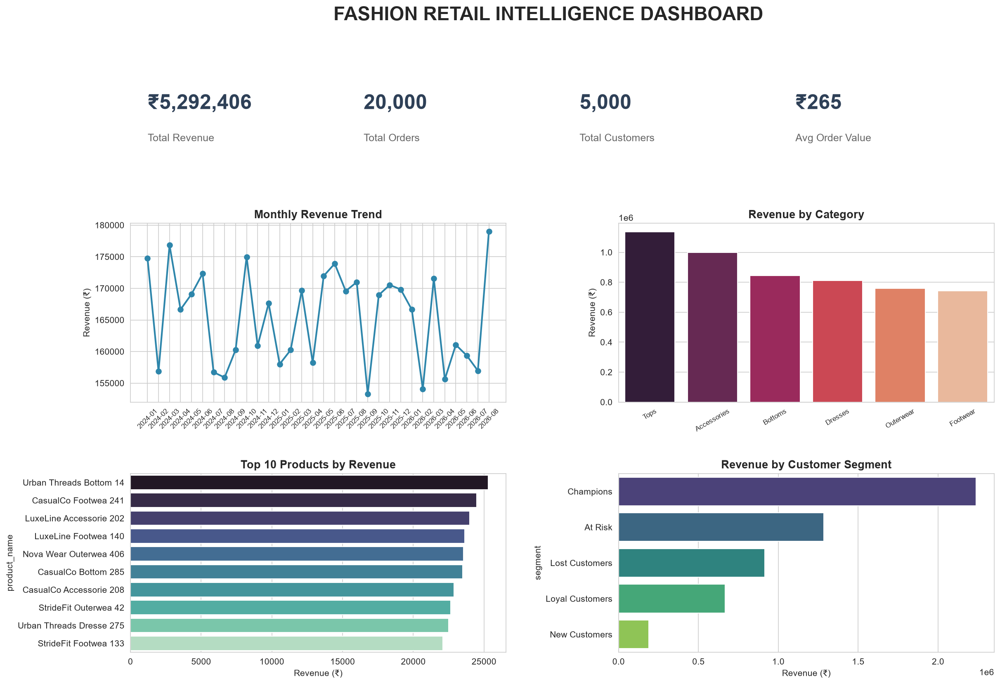

# Fashion Retail Intelligence Dashboard

An end-to-end data analytics project simulating a retail analytics team's workflow: from raw data generation through SQL analysis, Python-based customer segmentation, and an interactive Power BI dashboard.

## Business Problem

A fashion retail company wants to understand: **What should we sell, reorder, discount, and invest in for the next season — and why?**

This project answers that using a full data pipeline built on realistic (synthetic) retail data covering customers, products, orders, inventory, and returns.

## Tech Stack

- **Python** (pandas, NumPy, Faker) — data generation and analysis
- **MySQL** — relational database (7 connected tables)
- **SQL** — joins, aggregations, window functions
- **Power BI** — interactive dashboard
- **Matplotlib / Seaborn** — static visualizations

## Project Structure

| File | Purpose |
|---|---|
| `generate_data.py` | Generates a realistic synthetic dataset: customers, products, stores, orders, order_items, inventory, returns |
| `load_to_sql.py` | Loads all CSVs into a MySQL database (`retail_db`) |
| `queries.sql` | 7 core SQL business queries (revenue, top products, monthly trend, category performance, top customers, slow movers, category rankings) |
| `analysis.py` | Python/pandas analysis, including RFM (Recency, Frequency, Monetary) customer segmentation |
| `dashboard.py` | Generates a static all-in-one dashboard image using matplotlib/seaborn |
| `ai_analyst.py` | Rule-based analyst layer — automatically detects patterns in the data and generates plain-English business insights and recommendations |

## Key Findings

- **Total revenue**: ₹52.9L across 20,000 orders from 5,000 customers
- **Tops** is the leading product category, generating the highest share of total revenue
- **West** is the top-performing region, outperforming the lowest region by over 150%
- Customer segmentation (RFM) identified a **"Champions"** segment contributing the largest share of revenue, alongside an "At Risk" segment worth targeted retention efforts
- A set of consistently slow-moving products were identified as candidates for discounting or discontinuation

## Dashboard

An interactive Power BI dashboard was built on top of the MySQL database, featuring:
- KPI cards (Total Revenue, Total Orders, Total Customers, Units Sold)
- Revenue by Category (donut chart)
- Monthly Revenue Trend (line chart)
- Revenue by Region (pie chart)
- Top 10 Products by Revenue (bar chart)

## How to Run

1. Run `generate_data.py` to create the dataset
2. Run `load_to_sql.py` to load it into MySQL
3. Run the queries in `queries.sql` against the database
4. Run `analysis.py` for RFM segmentation
5. Run `dashboard.py` to generate the static dashboard image
6. Run `ai_analyst.py` to generate automated business insights

## Future Improvements

- Demand forecasting (moving average / seasonal models)
- What-if simulator for pricing and inventory decisions
- LLM-powered natural language querying of the dataset